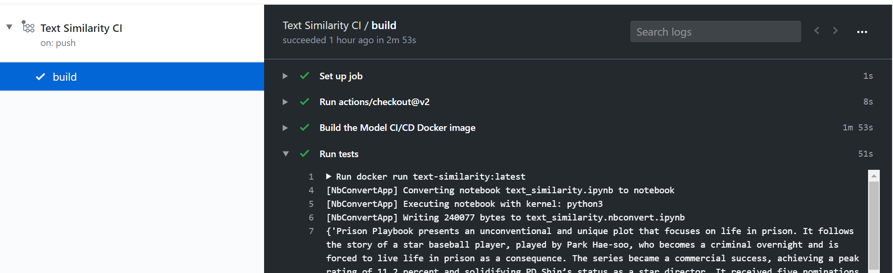

# Continuous Integration for Jupyter Notebooks


## How it works
1. A Github workflow is configured to monitor pull requests for a project's path.
  ```
  on:
    ...
    pull_request:
      branches: [ master ]
      paths:
      - 'text-similarity/**'
  ```

2. A developer makes changes to a Jupyter notebook for that project and updates the pull request. For example, you can commit to the pull request branch from Google Colaboratory or from your local machine.

3. The workflow is triggered, which then:
  
   a. Builds a Docker container with the Jupyter notebook
   ```
   steps:
   - uses: actions/checkout@v2
   - name: Build the Model CI/CD Docker image
      working-directory: ./text-similarity
      run: docker build . --file Dockerfile --tag text-similarity:latest
   ```
   
   b. Runs the Docker container to execute the Jupyter notebook and generate artifacts (which can include the model weights or anything that the notebook produces)

   c. Runs a Python unit test to validate the model artifacts. For example, do a prediction and check expected metrics. The artifacts are copied to the mapped docker volume. If the test passes, the upload-artifact action will zip the artifacts from this test run for further analysis.

   Workflow step:
   ```
    - name: Run tests
      run: docker run -v "$GITHUB_WORKSPACE/artifacts":/artifacts text-similarity:latest
    - name: Archive artifacts
      uses: actions/upload-artifact@v1
      with:
        name: artifacts
        path: artifacts
   ```
      
   Entrypoint for the container:
   ```
   #!/bin/sh

   # Execute the Jupyter notebook to train the model
   /opt/conda/bin/jupyter nbconvert --to notebook --execute $NOTEBOOK_SRC

   # Run CI test
   python ci_test.py

   # Copy artifacts and list them
   cp *.pkl /artifacts/.
   ls -alR /artifacts   
   ```

  
