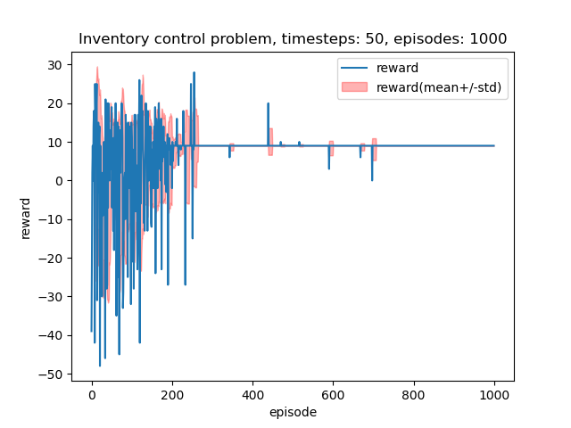

## Setup

System: Raspberry Pi 4 with Docker installed.

1. Launch docker environment
```
sh launch_docker.sh
```
2. Activate virtual environment
```
. /app/bin/activate
```
3. Run script(s)
```
cd sph
python3 inventory.py
```

## Sparse Predictive Hierarchies (SPH)
https://github.com/ogmacorp/OgmaNeo2/blob/master/SPH_Presentation.pdf

SPH is an alternative to Back Propagation for learning. It uses a bi-directional hierachy of encoder / decoder layers to iteratively create a sparse representation of any signal / state. 


*Source: https://github.com/ogmacorp/OgmaNeo2/blob/master/SPH_Presentation.pdf*


Each layer is a sparse matrix which encodes its own state, and tries to predict the next state using context from current and previous layers.  The layers are updated during the upward/encoding direction, and evaluated during the downward/decoding direction. 

SPH has been applied to perform predictions and also as an alternative to Deep Reinforcement Learning.

## PyOgmaNeo2 CartPole Example
https://github.com/ogmacorp/PyOgmaNeo2/blob/master/examples/CartPole.py

## Inventory Cost Control


Example 1.1 in [Algorithms for Reinforcement Learning by Csaba Szepesvari (2010)](https://sites.ualberta.ca/~szepesva/RLBook.html)

Environment: https://github.com/paulhendricks/gym-inventory/blob/master/gym_inventory/envs/inventory_env.py (used forked version from https://github.com/ivallesp/gym-inventory, thanks!)

### Scenario
1. Evening: Inventory manager decides the quantity to be ordered for the next day.
2. Morning: Inventory is filled up with the ordered quantity.
3. During the day: Stochastic demand.

Goal: Maximise expected total future income.

### Problem Setup

State: X[t], t >=0: the inventory size in evening of day t

Action: A[t], t >=0: the number of items ordered in evening of day t

Next state: X[t+1] = min(X[t] + A[t], M - D[t+1])

Payoff at time step t:
- Cost associated with purchasing A[t] items = K(if A[t] > 0) + c*A[t]
- Cost of holding inventory of size x = h * x
- Value of selling z units = p * z
- Note: p > h in order for there to be incentive to order new items
- M = maximum inventory size

Revenue on day t+1: R[t+1] = sale_value - (fixed_purchase_cost +  variable_purchase_cost + holding_cost)
  - sale_value = p*min(X[t]+A[t], M-X[t+1])
  - fixed_purchase_cost = K(if A[t] > 0)
  - variable_purchase_cost = c*min(X[t]+A[t], M-X[t])
  - holding_cost = h*X[t]
- (X[t+1], R[t+1]) is a function of (X[t], A[t], D[t+1])

### Results

Here's a plot of the reward history, using M=50, D ~ Poisson(lamba=25), 1000 episodes, and 50 timesteps per episode.

Here, the reward represents the revenue.



The initial revenue fluctuates, and finally stablises to positive value (9 or 10) after about 500 episodes.

## Stock Trading

Environment: https://github.com/AminHP/gym-anytrading/blob/master/gym_anytrading/envs/trading_env.py
